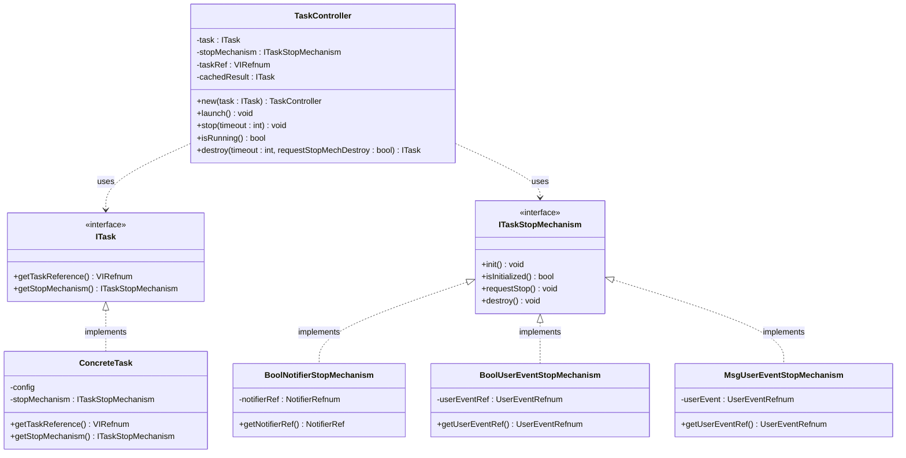

# TLC_Daemon

**Asynchronous Lifecycle & Task Engine for LabVIEW**

---

## Overview

**TLC_Daemon** is a lightweight LabVIEW toolkit for launching, controlling, and stopping asynchronous background tasks in a clean, object-oriented way.
The name is inspired by the Unix/Linux concept of a daemon: a process running silently in the background, independently from the caller. Unlike system daemons, TLC_Daemon tasks have a well-defined lifecycle and are designed to be started and stopped on demand.

TLC_Daemon encapsulates the recurring pattern of asynchronous task management in LabVIEW (launching a VI asynchronously, controlling its lifecycle, handling cooperative stop, and retrieving the final result) into a clean, reusable, and extensible structure. It defines a systematic way to pass data to these tasks and stop them cleanly.


TLC_Daemon provides a minimal but powerful abstraction to manage:

- Asynchronous execution
- Task lifecycle (start, stop, completion)
- Cooperative soft-stop mechanisms
- Final result retrieval

The goal is a **simple and consistent framework** without unnecessary complexity or heavy infrastructure.

## Core Concept

In TLC_Daemon, a **task** is an asynchronous VI that runs independently, controlled through a `TaskController`, with a well-defined lifecycle and a cooperative stop mechanism. The `TaskController` is responsible for orchestrating the full lifecycle of a task, from startup to completion.

Each task:

- Runs asynchronously
- Receives its configuration via an `ITask` object
- Can be stopped via a soft-stop mechanism
- Returns its final state as an output object


## Architecture

The system is built around three main components. Each component has a single responsibility and interacts through well-defined interfaces.



### `ITask` (Interface)

Defines the contract for any task.

| Method | Returns |
|---|---|
| `getTaskReference()` | `VIRefnum` |
| `getStopMechanism()` | `ITaskStopMechanism` |

### `ITaskStopMechanism` (Interface)

Encapsulates how a task is requested to stop.

| Method | Description |
|---|---|
| `init()` | Initializes the stop mechanism (e.g. creates the notifier, or user event) |
| `isInitialized()` | Returns `True` if the mechanism is already initialized, `False` otherwise |
| `requestStop()` | Signals the task to stop |
| `destroy()` | Destroys the underlying primitive (e.g. releases the notifier or user event) |

The `TaskController` does not need to know *how* the stop works, only that it can trigger it.

#### Initialization

`ITaskStopMechanism` supports two initialization modes:

- **Internal initialization**: the `TaskController` calls `init()` automatically during `launch()` if `isInitialized()` returns `False`. The controller also owns the lifecycle of the mechanism and calls `destroy()` when appropriate.
- **External initialization**: the mechanism is initialized before being passed to the task. `isInitialized()` returns `True`, so the `TaskController` skips `init()`. This is useful when the mechanism needs to be shared with other components — for example, a message user event used both to stop the task and to communicate with it from outside.

> **Note:** Use external initialization carefully. The `TaskController` will call `requestStop()` on the mechanism, which may affect any external code sharing the same primitive.

#### Built-in implementations

TLC_Daemon ships with three ready-to-use stop mechanism implementations covering the most common LabVIEW patterns: `BoolNotifierStopMechanism` for boolean notifier-based stop, `MsgUserEventStopMechanism` for event-driven stop, and `BoolUserEventStopMechanism` for message-based stop. Custom mechanisms can be added by implementing `ITaskStopMechanism`.

`ITaskStopMechanism` intentionally exposes only `requestStop()` and not a dual `checkStop()` method. Reading the stop signal is always done directly by the task VI, which, after casting to the concrete type, has direct access to the underlying primitive. This avoids unnecessary dynamic dispatch overhead in the task loop and, more importantly, makes the pattern compatible with LabVIEW Event Structures: a user event must be handled inside an Event Structure in the task VI itself, and cannot be encapsulated behind a method call.

### `TaskController`

Central component responsible for managing the task lifecycle.

| Method | Description |
|---|---|
| `new(task)` | Creates a new controller and associates the task |
| `launch()` | Launches the task asynchronously. Single use |
| `stop(timeout)` | Requests stop and waits for completion |
| `isRunning()` | Checks actual execution state; collects result if already finished |
| `destroy(timeout)` | Calls `stop` if the task is still running, then returns `ITask out` |


## Execution Flow

### New + Launch

1. `TaskController.new(task)` is called (the task is associated with the controller)
2. `TaskController.launch()` is called
3. Controller retrieves the VI reference via `ITask.getTaskReference()`
4. Controller calls `isInitialized()` on the stop mechanism. If `False`, calls `init()`
5. VI is launched asynchronously
6. Async call reference is stored internally

### Stop

1. `TaskController.stop(timeout)` is called
2. Controller calls `requestStop()` on the stop mechanism
3. Controller waits via `Wait on Asynchronous Call`
4. `ITask out` is retrieved and cached internally

### Destroy

1. `TaskController.destroy(timeout)` is called
2. If the task is still running, `stop` is called internally
3. The cached `ITask out` is returned to the caller

### Passive Completion

If a task stops on its own, the `TaskController` detects it the next time `isRunning()` or `stop()` is called. The result is retrieved and cached at that point.


## Task VI Contract

Every task must follow a standard connector pane:

| Terminal | Direction |
|---|---|
| `ITask in` | Input |
| `error in` | Input |
| `ITask out` | Output |
| `error out` | Output |

LabVIEW enforces connector pane compatibility natively when the VI is launched asynchronously. No additional validation is needed.


## Asynchronous Dynamic Dispatch Pattern

LabVIEW does not support dynamic dispatch directly when launching a VI asynchronously. When working with class hierarchies, the typical workarounds are building the VI path programmatically at runtime, setting connector pane inputs manually, or wrapping the polymorphic call inside a statically-referenced VI that handles dispatch internally. All of these approaches add complexity and boilerplate.

TLC_Daemon establishes a consistent pattern that eliminates these workarounds. `getTaskReference()` acts as the dispatch mechanism: the `TaskController` calls it on whatever `ITask` object it receives, and gets back the correct VI reference automatically. Polymorphism is used *before* the asynchronous launch, to select the VI, rather than during it. No wrappers, no dynamic path construction. If two concrete tasks are available and the caller passes the right one to the `TaskController`, the correct VI is launched without any additional logic.

The second part of the pattern concerns data passing. In LabVIEW, passing data to and retrieving results from an asynchronously launched VI requires knowing its connector pane in advance. TLC_Daemon solves this by imposing a standard connector pane on all task VIs (`ITask in`, `error in` → `ITask out`, `error out`), which the `TaskController` relies on to pass data consistently across all implementations. LabVIEW enforces this contract natively at launch time. Inside the task VI, the cast from `ITask` to the concrete class gives the task access to its own private data, keeping the controller generic and the task self-contained.


## Implementing a Task

### 1. Create a class that implements `ITask`

Store configuration data in the class private data, and implement:

- `getTaskReference()` — returns the VI reference for this task
- `getStopMechanism()` — returns the appropriate stop mechanism

### 2. Write the task VI

```
Inputs:  ITask in, error in
Outputs: ITask out, error out

Logic:
  Cast ITask in → ConcreteTask
  Loop:
    Execute task logic
    Check stop signal
  On stop:
    Cleanup
    Return updated task as ITask out
```

> **Note:** The cast is the responsibility of the task implementer. The controller does not validate class/VI compatibility. A mismatch between the task class and the VI will result in a runtime error.

## Example

### `DataLoggingTask`

```
Class: DataLoggingTask implements ITask

Private Data:
  - file path           : Path
  - user event ref      : User Event Refnum
  - stop notifier       : Notifier Ref

getTaskReference()  → DataLoggingTask.vi
getStopMechanism()  → BoolNotifierStopMechanism
```

### `DataLoggingTask.vi` behavior

```
Cast ITask → DataLoggingTask
Loop:
  Acquire data
  Write to file
  Check notifier (stop signal)
On stop:
  Flush and close file
  Return updated DataLoggingTask as ITask out
```


## Stop Mechanism Design

Stop is always **cooperative (soft stop)**. The controller triggers the stop; the task owns the shutdown.

Supported patterns:

- Boolean notifier
- Message user event (e.g. "Stop" command)
- Boolean user events

No forced abort is used. Tasks must regularly check the stop condition and exit cleanly.


## State Handling

The `TaskController` uses a **lazy synchronization model** (it does not actively monitor tasks).

State is updated only when `isRunning()` or `stop()` is called. Internally, the controller tracks:

- Async call reference validity
- Whether the result has been collected
- Cached `ITask out`

The async result is collected **only once** and then cached. `stop()` is safe to call even after the task has already completed (it returns the cached result without error).
This approach keeps the controller lightweight while ensuring consistency when interacting with completed tasks.


## Design Goals

- Simplicity first
- Minimal boilerplate
- Strong separation of concerns
- Extensibility without complexity
- LabVIEW-native patterns


## When to Use TLC_Daemon

Use it when you need:

- Background tasks with a defined lifecycle
- Controlled startup and shutdown
- Pluggable stop mechanisms
- Reusable async execution patterns

TLC_Daemon is intentionally minimal. Task orchestration, messaging, and more complex patterns can be built on top of it. This toolkit may provide the foundation, not the full solution.

## Requirements

- LabVIEW 2023 or later

## Source Code

The full source code for this package is available on GitHub:
https://github.com/andcadev/TLC_Daemon

## License

This project is licensed under the MIT License.
See [LICENSE](LICENSE) file for details.

## Author

**Andrea Cadei**  
Creator of [*The LabVIEW Corner*](https://thelabviewcorner.com)

GitHub: https://github.com/andcadev  
Website: https://thelabviewcorner.com  
LinkedIn: https://www.linkedin.com/in/andrea-cadei/
